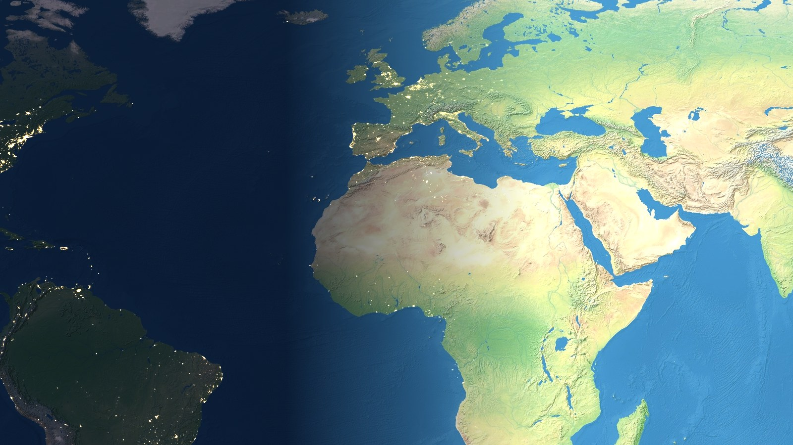
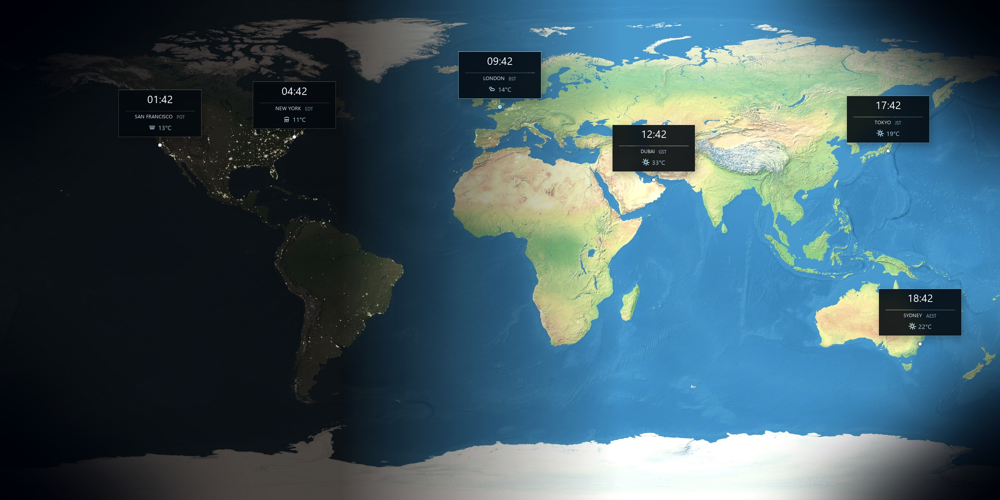
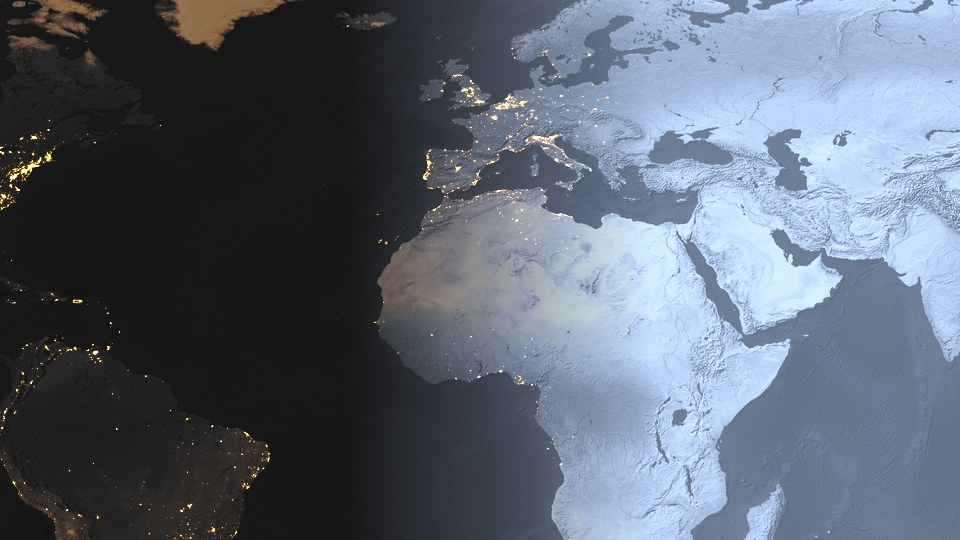

# I built a live Earth wallpaper for Windows

**Series:** 01 · Orblune · CByBB

Medium tags: `Windows`, `Wallpaper`, `Indie Dev`, `Desktop`, `Orblune`

---

For months my desktop background was the same photo. Fine image. Never changed.

I kept wishing the map behind my icons would track the real sun — day side bright, night side with city lights — and show times for a few cities I actually care about. Not another floating widget pack. Just wallpaper that behaves like Earth.

So I built **Orblune**, a live Earth wallpaper for Windows 10/11.

Try it: [https://cbybb.github.io/Orblune/](https://cbybb.github.io/Orblune/)  
Code: [https://github.com/CByBB/Orblune](https://github.com/CByBB/Orblune)

I’m CByBB on GitHub (also CodeByBB / BB / B.B. depending on the account). This is article **01** in a short series about making Orblune — what worked, what fought back, and what’s next.

---

## What Orblune does (the short list)

- Flat Earth map as wallpaper under your desktop icons  
- Day/night from real sun position  
- City cards with local time  
- Weather on those cards (MET Norway)  
- Optional map themes if you unlock Premium  
- Multi-monitor: turn screens on/off, theme per display when Premium  

Free tier is usable. Premium is a one-time unlock, not a subscription. I built the free path first so I could run it myself every day.

---

## Challenge 1: Windows doesn’t want you here

The UI is a Tauri WebView. The painful part is hosting.

On Windows, live wallpaper usually means parenting your window into Explorer’s `WorkerW` layer. Docs for that are mostly blog posts and old forum threads. My first builds either:

- sat on top of icons (useless), or  
- attached once, then died after a display sleep, or  
- “fixed” themselves by reattaching every few seconds and making the taskbar flicker  

I learned the hard way that sending Progman’s magic `0x052C` message too often flashes the whole desktop. So I started caching the WorkerW handle and only spawning it when it’s actually missing. I also loosened the “are we still on the right monitor rect?” check — exact pixel match was wrong under DPI scaling and caused false reattach loops.

One night the wallpaper just vanished. Icons on a blank host. No crash dialog. I sat there clicking the tray icon like that would help. Logging eventually showed the cached parent was dead and we were too polite to recreate it. That fix was small. Finding it wasn’t.

If you write Windows wallpaper software: budget more time for Explorer than for your shaders.

---

## Challenge 2: the globe looked fine; the clocks lied

Early on I had collision code that nudged city cards away from each other so labels wouldn’t overlap. Looked tidy in screenshots. On a live map it meant London slowly drifted off London.

I ripped the collision nudge out. Cards stay locked to lat/lon. Overlap happens sometimes. I’d rather have an honest pin than a pretty lie.

Seconds on the clock was another trap. Showing `HH:MM:SS` made the card width pulse every second unless the layout was locked. Fixed width + optional seconds only for Premium with “show seconds” on. Sounds obvious now. It wasn’t at 2 a.m. when I thought the font was broken.

Weather refresh had a similar “obvious in hindsight” bug. I cleared the weather cache while fetching, the line went empty, the card height collapsed, then jumped back. For a live wallpaper you stare at all day, that blink is loud. Fix: keep the last weather on screen until the new payload arrives.

---

## Challenge 3: themes, monitors, and “it works on my machine”

Once the host was stable, I graded the Natural Earth day map in the fragment shader — sea glass, ember, noir, ink, frost, sand, and the rest. Same textures, different look.

Multi-monitor came next. Listing monitors in Rust was fine. The product question was harder: if someone has three screens, which ones get Orblune? I ended up with per-display enable toggles, and Premium can set a theme per screen. On a single monitor that UI hides itself so the settings page doesn’t look empty and confused.

Dual-monitor testing still surprises me. Sleep one panel, wake it, and Windows rearranges work areas just enough to make you doubt your math.

---

## Challenge 4: shipping with my name on the exe

Publishing scared me more than WorkerW.

Signing: I ship an NSIS installer for the current user (no admin). Without an Authenticode certificate, SmartScreen may warn once. I put that on the site honestly. VirusTotal links go on each GitHub release so people can check the build.

Money: Premium is crypto checkout through a small worker, license signed locally. Getting that path less embarrassing than “email me for a key” took longer than I expected.

I still hit publish. The site is [cbybb.github.io/Orblune](https://cbybb.github.io/Orblune/). If something breaks on your PC, [open an issue](https://github.com/CByBB/Orblune/issues) or mail [software.vision@dreambuild.cloud](mailto:software.vision@dreambuild.cloud).

---

## What’s next: Mac and Ubuntu

Windows was first because that’s what I use daily, and because the wallpaper hosting problem is very Windows-shaped.

I’m planning native builds for **macOS** and **Ubuntu** next. Not a thin Electron wrap-and-pray — I want the same idea (live Earth, clocks, weather) on each platform’s real desktop integration path. macOS and Linux don’t use WorkerW; they have their own rules, permissions, and “please don’t fight the window manager” moments. That’ll be its own pile of notes (probably article **03** or **04** once I have scars to show).

Before that, **02** will stay on Windows: multi-monitor edge cases, updater weirdness, or whatever breaks in my tray logs this week.

---

## Links

- Download / site: [https://cbybb.github.io/Orblune/](https://cbybb.github.io/Orblune/)  
- GitHub: [https://github.com/CByBB/Orblune](https://github.com/CByBB/Orblune)  
- Issues: [https://github.com/CByBB/Orblune/issues](https://github.com/CByBB/Orblune/issues)  
- Email: [software.vision@dreambuild.cloud](mailto:software.vision@dreambuild.cloud)

Thanks for reading. More soon in **02**.

— CByBB
